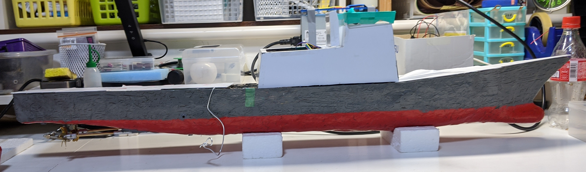
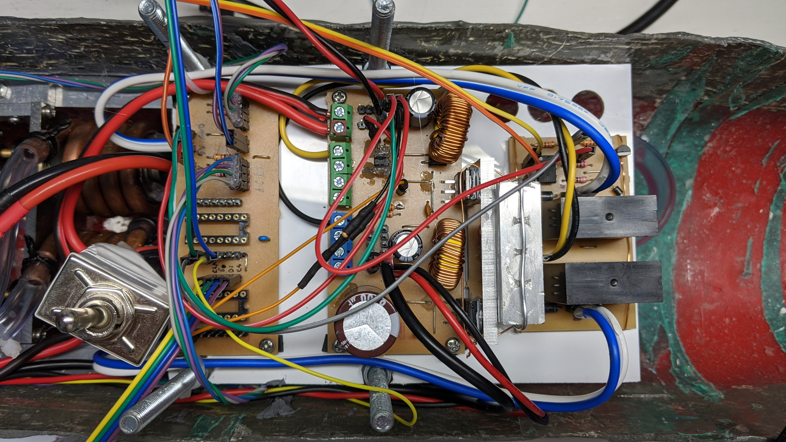
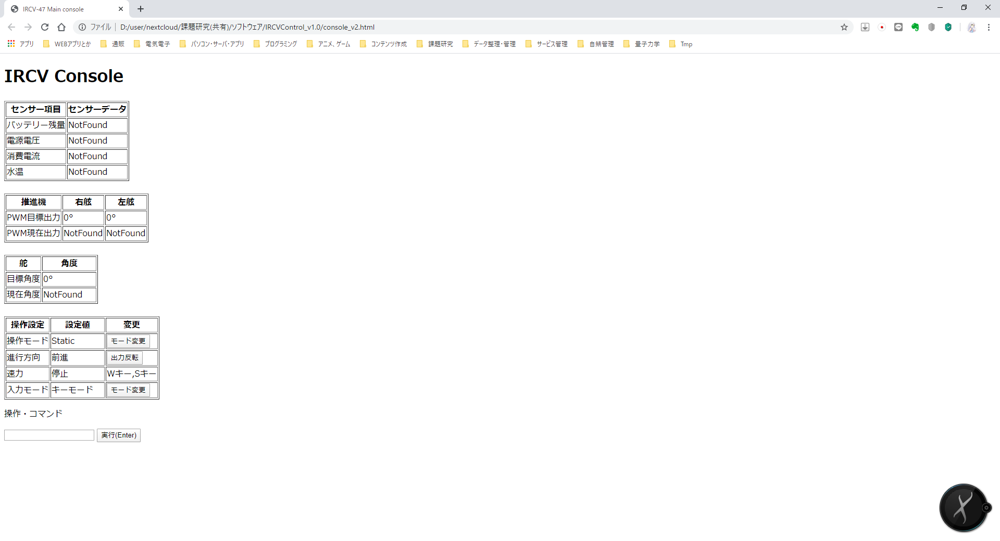
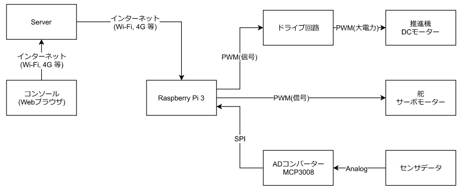

# TCP/IPを用いたラジコン船(IRCV)のプログラム

## 概要
工業高校卒業時に課題研究として制作したプロジェクトの、ソースコードと本プロジェクトの説明です。  
[Pythonのソースコード](src)

## 目的
インターネット経由で遠隔操作できるラジコン船を制作し、どの程度使用できるのかを実験する。  

## 背景
ラジコン船をインターネット経由で制御することができれば、モバイルデータ通信がつながる範囲であれば途中で通信が途切れなく、また、電波塔などの通信インフラを構築しなくてよい。  

## 実験結果

本プロジェクトを通して、インターネット経由でラジコン船を制御することが可能であることを検証した。  
今後の課題としては、ラジコン船側の電源及び通信手段を高性能化して、より陸から遠いところに行けるようにすることがあげられる。  

## 成果物
動作試験  
https://github.com/irumaru/ircv/assets/46730701/d44fdc7c-f225-49f3-a3c7-f39d8ced475d

本体

制御装置

操作画面

## システム構成

## 時期

### 第1期(原理実証)

構想: 2017～  
開発開始: 2019～  
完成: 2020  

### 第2期(高性能化)

時間と予算と人員の不足により未定  
